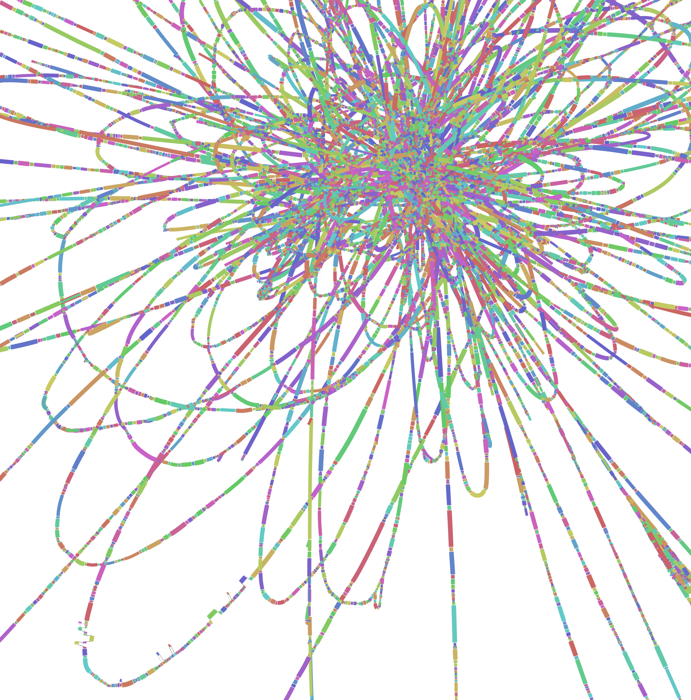
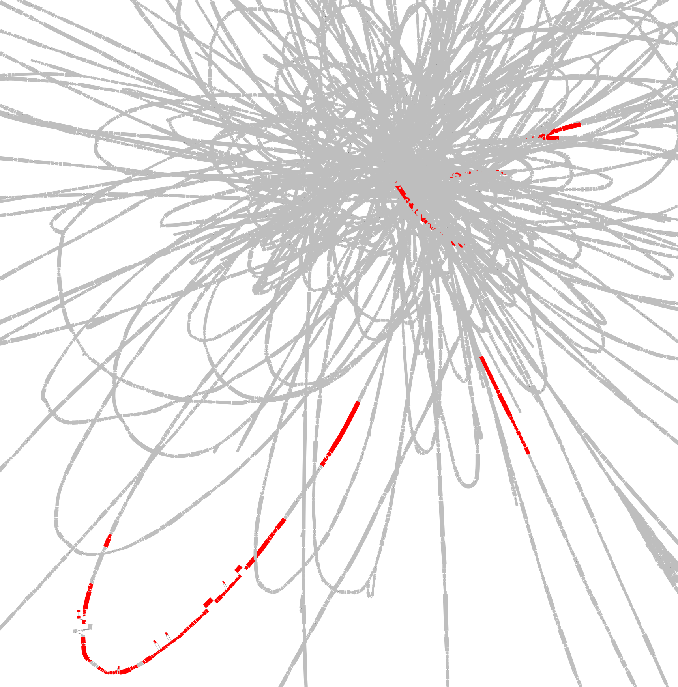

# Ebame6

# STRONG - Strain Resolution ON Graphs

## Overview

STRONG resolves strains on assembly graphs by resolving variants on core COGs using co-occurrence across multiple samples.

In this tutorial we will run the complete STRONG pipeline on a small AD time series. To 
begin we need to set-up our config file. This has been **mostly** prepared for you but will require a small amount of editing. 

## Getting started

Create a VM - EBAME-Quince preferably 8 cores xlarge and login with ssh using X-windows forwarding.

Then we activate the STRONG conda

```
conda activate STRONG_db1
```

## Coassembly

Start off by moving into the /mnt directory create new directory Projects (if not already there) and subdirectory STRONG_AD:

```
cd ~/data/mydatalocal

mkdir Projects

cd Projects

mkdir STRONG_AD

cd STRONG_AD

```

Then copy in the short reads:

```

wget https://ebame6.s3.climb.ac.uk/data_small.tar.gz

cp /some/path/Tutorial/data_small.tar.gz .

tar -xvzf data_small.tar.gz


```
Have a look at the data folder structure:

```
ls data
```

<details><summary>Can you count the number of reads in sample1?</summary>


<p>

```
echo $(cat data/sample1sample1/sample1_R1.fastq |wc -l)/4|bc
```

</p>
</details>


Now copy in the STRONG config file:

```
cp ~/repos/Ebame21-Quince/configs/config.yaml .
```

Add this command to the `bayespaths` subsection if not present using your favourite 
command line text editor:

```
optional_args: '--nofilter'
```

Minimise that pesky prompt!
```
PS1='\u:\W\$ ' 
```

We will begin by performing the SPADEs coassembly. First good practice is to check what would be run if command issued:

```
STRONG --config config.yaml Results assembly --threads 8 --dryrun --verbose
```

Will run over 150 processes! STRONG is a complex pipeline.


Then run coassembly for real:

```
STRONG --config config.yaml Results assembly --threads 8 --verbose
```

This should take about twenty minutes. When it does done we can have a look at the coassembly outputs. The actual contigs are here:

```
./Results/assembly/spades/contigs.fasta
```

How good was the coassembly, what was the N50?


```
~/repos/Ebame21-Quince/scripts/contig-stats.pl < ./Results/assembly/spades/contigs.fasta
```

sequence #: 1966	total length: 6377796	max length: 174676	N50: 28942	N90: 3000

Other useful things to look at include the simplified graph that will be used for strain resolution.


```
ls -l -h assembly/high_res/simplified.gfa
```

 

And the unitig per sample profiles:

```
tail assembly/high_res/simplified.mult_prof
```

 
